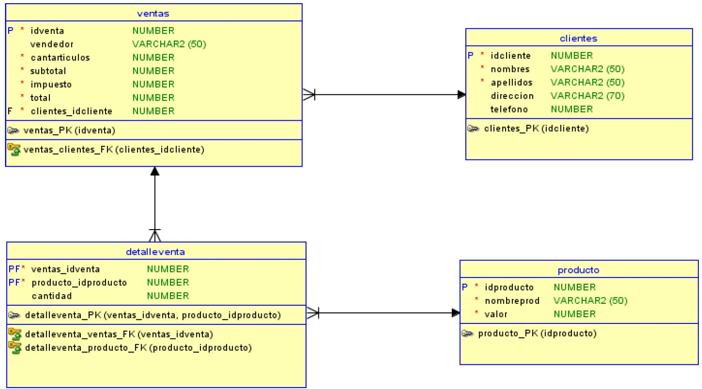
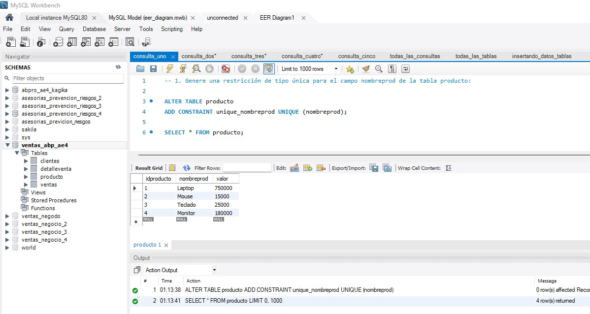
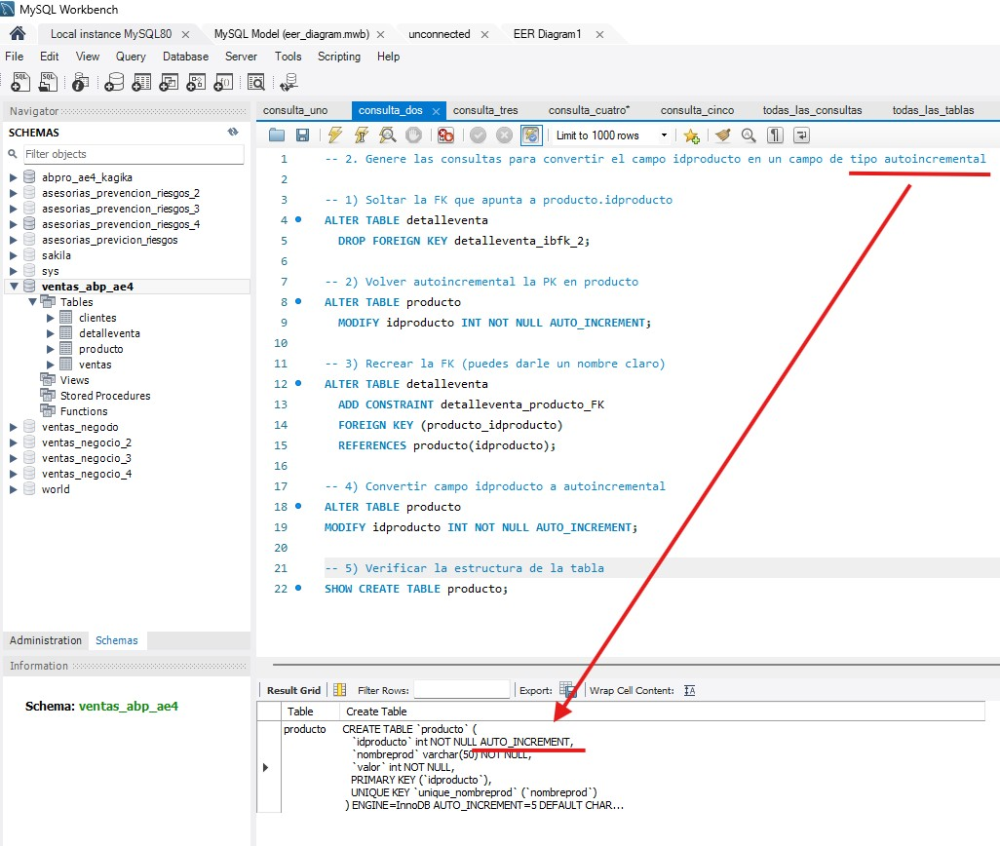
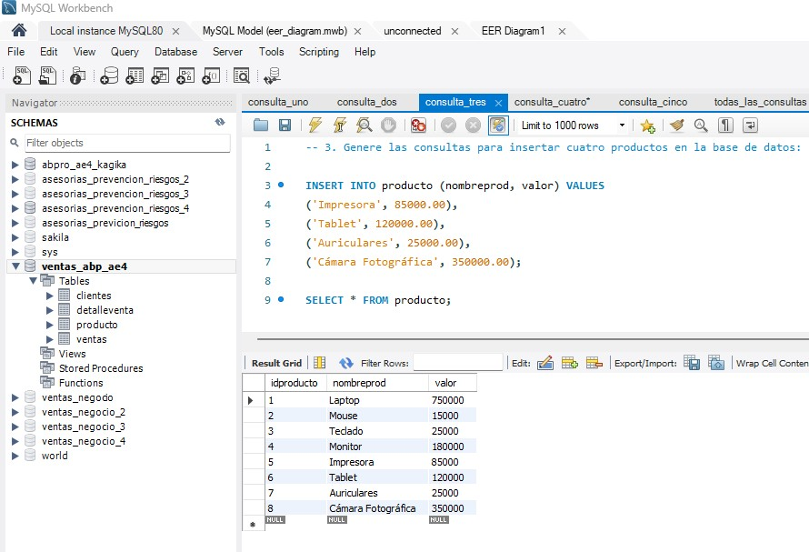
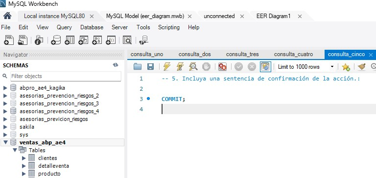
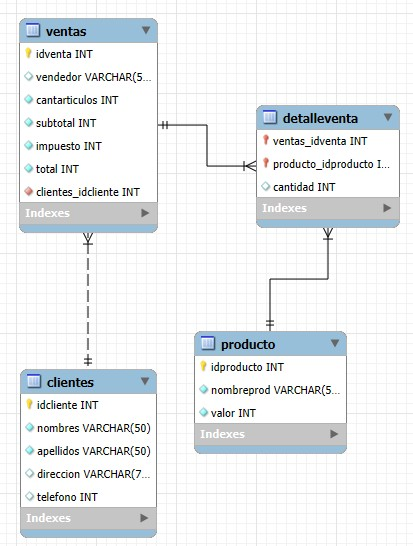

**_<h1 align="center">:vulcan_salute: Base de Datos Ventas M4_ABP_AE4:computer:</h1>_**


**<h3>:blue_book: Contexto de la Actividad:</h3>**

<p>Este ejercicio es la continuación de los ejercicios individuales del día anterior</p>
<p>Un negocio minorista desea llevar registro de las ventas diarias realizadas. Para ello ha creado el siguiente modelo de datos.</p>



**<h3>:orange_book: Requerimientos:</h3>**

<p>En un archivo de texto, agregue las siguientes consultas:</p>
<ul>
    <li>Genere una restricción de tipo única para el campo nombreprod de la tabla producto.</li>
    <li>Genere las consultas para convertir el campo idproducto en un campo de tipo autoincremental.</li>
    <li>Genere las consultas para insertar cuatro productos en la base de datos. Recuerde hacer uso de la secuencia.</li>
    <li>Genere las consultas para insertar ocho registros en la tabla detalleventa.</li>
    <li>Finalmente, incluya una sentencia de confirmación de la acción.</li>
</ul>

**<h3>:green_book: Construcción de la Base de Datos:</h3>**

<p>Creando la base de datos con las tablas ventas, clientes, detalleventa y producto:</p>

```SQL
CREATE TABLE clientes (
  idcliente INT PRIMARY KEY NOT NULL,
  nombres   VARCHAR(50) NOT NULL,
  apellidos VARCHAR(50) NOT NULL,
  direccion VARCHAR(70),
  telefono  INT
);

CREATE TABLE producto (
    idproducto INT PRIMARY KEY NOT NULL,
    nombreprod VARCHAR(50) NOT NULL,
    valor INT NOT NULL
);

CREATE TABLE ventas (
  idventa INT PRIMARY KEY NOT NULL,
  vendedor VARCHAR(50),
  cantarticulos INT NOT NULL,
  subtotal INT NOT NULL,
  impuesto INT NOT NULL,
  total INT NOT NULL,
  clientes_idcliente INT NOT NULL,
  FOREIGN KEY ( clientes_idcliente ) REFERENCES clientes ( idcliente )
);

/* ALTER TABLE ventas
ADD CONSTRAINT ventas_clientes_fk
FOREIGN KEY (clientes_idcliente)
REFERENCES clientes (idcliente); */

CREATE TABLE detalleventa (
    ventas_idventa INT NOT NULL,
    producto_idproducto INT NOT NULL,
    cantidad INT,
    PRIMARY KEY (ventas_idventa, producto_idproducto),
    FOREIGN KEY (ventas_idventa) REFERENCES ventas(idventa),
    FOREIGN KEY (producto_idproducto) REFERENCES producto(idproducto)
);
```

<p>Alimentando la base de datos y validando el ingreso de los datos:</p>

```SQL
-- Clientes
INSERT INTO clientes (idcliente, nombres, apellidos, direccion, telefono)
 VALUES
 (1,'Antonia','Aranda','Calle Los Aromos #123',991111111),
 (2,'Bernarda','Barros','Pasaje Manuel Balmaceda #456',992222222),
 (3,'Carlos','Costa','Avenida Simón Bolivar #789',993333333),
 (4, 'Juan', 'Pérez', 'Av. Siempre Viva 123', 987654321),
 (5, 'María', 'González', 'Calle Falsa 456', 912345678),
 (6, 'Pedro', 'López', 'Pasaje Azul 789', 987123456);
 SELECT * FROM clientes;

-- Productos
INSERT INTO producto (idproducto, nombreprod, valor) 
VALUES
(1, 'Laptop', 750000.00),
(2, 'Mouse', 15000.00),
(3, 'Teclado', 25000.00),
(4, 'Monitor', 180000.00);
SELECT * FROM producto;

-- Ventas
INSERT INTO ventas (idventa, vendedor, cantarticulos, subtotal, impuesto, total, clientes_idcliente) 
VALUES
 (1, 'Andrés Aranda', 3, 4500, 500, 5000, 1),
 (2, 'María López', 2, 1200, 100, 1300, 4),
 (3, 'Cristina Cortés', 3, 10480, 20, 10500, 2),
 (4, 'Daniela Durán', 1, 5000, 2500, 7500, 5),
 (5, 'Pedro Martínez', 3, 3800, 100, 3900, 3),
 (6, 'Ana Torres', 2, 6000, 300, 6300, 6);
 SELECT * FROM ventas;

-- Detalle de ventas
INSERT INTO detalleventa (ventas_idventa, producto_idproducto, cantidad) VALUES
(1, 1, 1), -- Venta 1: 1 Laptop
(1, 2, 1), -- Venta 1: 1 Mouse
(2, 2, 2), -- Venta 2: 2 Mouse
(2, 3, 1), -- Venta 2: 1 Teclado
(2, 4, 1); -- Venta 2: 1 Monitor
SELECT * FROM detalleventa;
```

**<h3>📁 Estructura del Proyecto:</h3>**

```
📁ventas_abp_ae4
└── README.md
└── 📁img
│    ├── 📁wireframes
│    │    └── wireframe_bbdd.jpg
│    ├── consulta_uno.jpg
│    ├── consulta_dos.jpg
│    ├── consulta_tres.jpg
│    ├── consulta_cuatro.jpg
│    ├── consulta_cinco.jpg
│    └── eer_diagram.jpg
└── 📁mysql
    ├── eer_diagram.mwb
    ├── 📁consultas
    │   ├── consulta_uno.sql
    │   ├── consulta_uno_con_registros.sql
    │   ├── consulta_dos.sql
    │   ├── consulta_dos_con_registros.sql
    │   ├── consulta_tres.sql
    │   ├── consulta_tres_con_registros.sql
    │   ├── consulta_cuatro.sql
    │   ├── consulta_cuatro_con_registros.sql
    │   ├── consulta_cinco.sql
    │   └── todas_las_consultas.sql
    └── 📁tablas
        ├── insertando_datos_tablas.sql
        └── todas_las_tablas.sql
```

**<h3>:blue_book: Consultas ejecutadas:</h3>**

1. Genere una restricción de tipo única para el campo nombreprod de la tabla producto:
```SQL
ALTER TABLE producto
ADD CONSTRAINT unique_nombreprod UNIQUE (nombreprod);
```



2. Genere las consultas para convertir el campo idproducto en un campo de tipo autoincremental:
```SQL
-- 1) Soltar la FK que apunta a producto.idproducto
ALTER TABLE detalleventa
  DROP FOREIGN KEY detalleventa_ibfk_2;

-- 2) Volver autoincremental la PK en producto
ALTER TABLE producto
  MODIFY idproducto INT NOT NULL AUTO_INCREMENT;

-- 3) Recrear la FK (puedes darle un nombre claro)
ALTER TABLE detalleventa
  ADD CONSTRAINT detalleventa_producto_FK
  FOREIGN KEY (producto_idproducto)
  REFERENCES producto(idproducto);

-- 4) Convertir campo idproducto a autoincremental
ALTER TABLE producto
MODIFY idproducto INT NOT NULL AUTO_INCREMENT;

-- 5) Verificar la estructura de la tabla
SHOW CREATE TABLE producto;
```


3. Genere las consultas para insertar cuatro productos en la base de datos:
```SQL
INSERT INTO producto (nombreprod, valor) VALUES
('Impresora', 85000.00),
('Tablet', 120000.00),
('Auriculares', 25000.00),
('Cámara Fotográfica', 350000.00);
```


4. Genere las consultas para insertar ocho registros en la tabla detalleventa:

```SQL
-- verifico los datos de los id antes de crear los nuevos registros
SELECT idproducto, nombreprod FROM producto ORDER BY idproducto;
SELECT idventa FROM ventas ORDER BY idventa;

-- ingresando nuevos datos
INSERT INTO detalleventa (ventas_idventa, producto_idproducto, cantidad) VALUES
(4, 6, 2),
(4, 7, 1),
(4, 8, 1),
(5, 6, 3),
(5, 5, 1),
(6, 7, 2),
(6, 8, 2),
(6, 5, 1);
```


5. Incluya una sentencia de confirmación de la acción.:

```SQL
COMMIT;
```


**<h3>:book: EER Diagram:</h3>**


